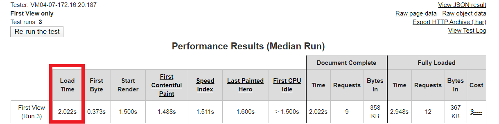

# CompareIt

### A React.JS based dashboard App

CompareIt is a modern interactive dashboard web-app that displays stats of sports players. Right now it has data of only 1 Indian cricket Player: Sachin Tendulkar. The program uses the career data of Sachin Tendulkar which was available in .csv format and later converted to json format to feed into dashboard components to show highlights of his career as a cricketer.

View this project live on [Netlify](https://compare-it.netlify.com/)

### Stacks Used:

#### 1. React.JS
This project was bootstrapped with [Create React App](https://github.com/facebook/create-react-app).
The project is completely modular with each component having its own .js file.

#### 2. echarts-for-react
This project uses [echarts-for-react](https://www.npmjs.com/package/echarts-for-react) to make interactive visualization components for dashboard to represent the career data in a easy to understand formats like pie-chart, bar-graph and line-graphs.

#### 3. TailwindCSS
This Project uses [Tailwind CSS](https://tailwindcss.com/) which is a highly customizable, unopinionated low-level CSS framework.

## Calculating Page load time

See performance result at [webpagetest.org](https://www.webpagetest.org/result/200203_97_dcf5194e4f846a07d655c29bbf5e68d8/)

##### served in 2.022s

## Optimization Process

#### Purge CSS

In this project we are using [Purgecss](https://www.purgecss.com/), a tool for removing CSS that we are not actually using in this project. Purgecss is particularly effective with Tailwind because Tailwind generates thousands of utility classes for us, most of which we probably won't actually use.

#### Importing Selective Modules Only

echarts-for-react (React wrapper for Echart.JS) has a lot of modules and thus results in a large file size if we import the complete package. Hence in order to reduce the build size we have only imported the required modules at a time in each component.

#### Using Webpack v4

create-react-app uses Webapck v4 under the hood. Although this step is kind of obvious, still I would like to describe what exactly is happening when we run the command "npm run build". This command creates a build folder for us which has minified javascripts and css for us after removing comments, spaces, etc. to have an optimized build for production/hosting.

## Available Scripts

In the project directory, you can run:

### `npm start`

Runs the app in the development mode. 
Open [http://localhost:3000](http://localhost:3000) to view it in the browser.

### `npm run build`

Builds the app for production to the `build` folder. 
It correctly bundles React in production mode and optimizes the build for the best performance.
